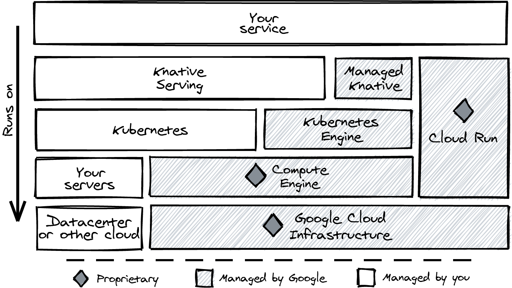

# Cloud Run and Knative serving

Cloud Run is API compatible with the open source project Knative Serving. That means that you are able to take a service from Cloud Run to Knative Serving without much (or with zero) effort.

I don’t think you should run Knative Serving on your local machine as a development environment. Docker offers a lightweight approach to orchestrating containers on your local machine with Docker Compose, as you discovered in Chapter 6.

You might wonder, then: why should I go through the trouble of this demonstration? This is why: building an application on a vendor-controlled platform carries a certain risk. Your vendor might change pricing or other terms unilaterally, making the platform less attractive for you. Portability refers to how easy it is to move your application to a different product or vendor, and I think it is important.

Another scenario that might drive you toward Knative Serving is when regulations require you to run your software and store your data in a geographic location where Google Cloud has no presence (such as the Chinese mainland).

## What is Knative Serving?

The primary goal of Knative Serving is to provide developers with a good abstraction for operating a stateless service that is container based and request driven and that scales from zero to many containers automatically. Just like on Cloud Run, you’ll create a service to deploy your container, and Knative creates a new immutable revision every time you change the service. A revision is a combination of your container image—at that point in time—and runtime configurations, such as environment variables and resource requirements (CPU and memory).

## Cloud Run Is Not Managed Knative Serving

A common misconception is that Cloud Run is a managed version of Knative Serving. This is not the case. Cloud Run is a compatible but completely separate and proprietary implementation of the same specification.

## Knative serving on Google Cloud



## Running Knative Serving Locally

Update gcloud and install minikube

```bash
gcloud components update
gcloud components install minikube
gcloud components install kubectl
```

Start a minikube cluster

```bash
minikube start --cpus 4 --memory 8192 --driver docker --kubernetes-version v1.19.2 --profile knative
```

Install the Knative Operator

```bash
kubectl apply --filename operator.yaml
```

Create the knative-serving namespace

```bash
kubectl create namespace knative-serving
```

In a separate terminal, start the Minikube tunnel and keep it running. It creates a network path to your cluster, ensuring that you can reach the private IPs on your cluster.

```bash
minikube tunnel --profile knative
```

Add the object that describes the Knative Serving extension.

```bash
kubectl apply --filename knative-serving.yaml
```

You need an HTTP Load Balancer because incoming requests need to be routed to Knative Serving. We are installing Kourier v0.17.0

```bash
kubectl apply --filename kourier.yaml
```

Kourier exposes an internal LoadBalancer, and the Minikube tunnel lets you send traffic to it. Let’s find the IP of the LoadBalancer Ingress:

```bash
kubectl -n kourier-system describe services kourier
```

Minikube tunnel adds routes from your host to the internal IPs in the local Kubernetes cluster. Knative uses host based routing, so you'll need to set up DNS.

(192.168.1.250.nip.io resolves to 192.168.1.250)

```bash
host 192.168.1.250.nip.io
```

Edit the `config-domain.yaml` file and add your LoadBalancer Ingress IP

```yaml
apiVersion: v1
kind: ConfigMap
metadata:
 name: config-domain
 namespace: knative-serving
data: 
 xxx.xxx.xxx.xxx.nip.io: ""
```

And apply it

```bash
kubectl apply --filename config-domain.yaml
```

## Deploying a service to Knative Serving

Use `service.yml` to deploy the inspect application

```bash
kubectl apply --filename service.yml
```

Find the URL

```bash
kubectl get ksvc
```

## Deploying the same service to Google Cloud

```bash
gcloud beta run services replace service.yml

gcloud run services add-iam-policy-binding hello \
  --member allUsers \
  --role roles/run.invoker
```

