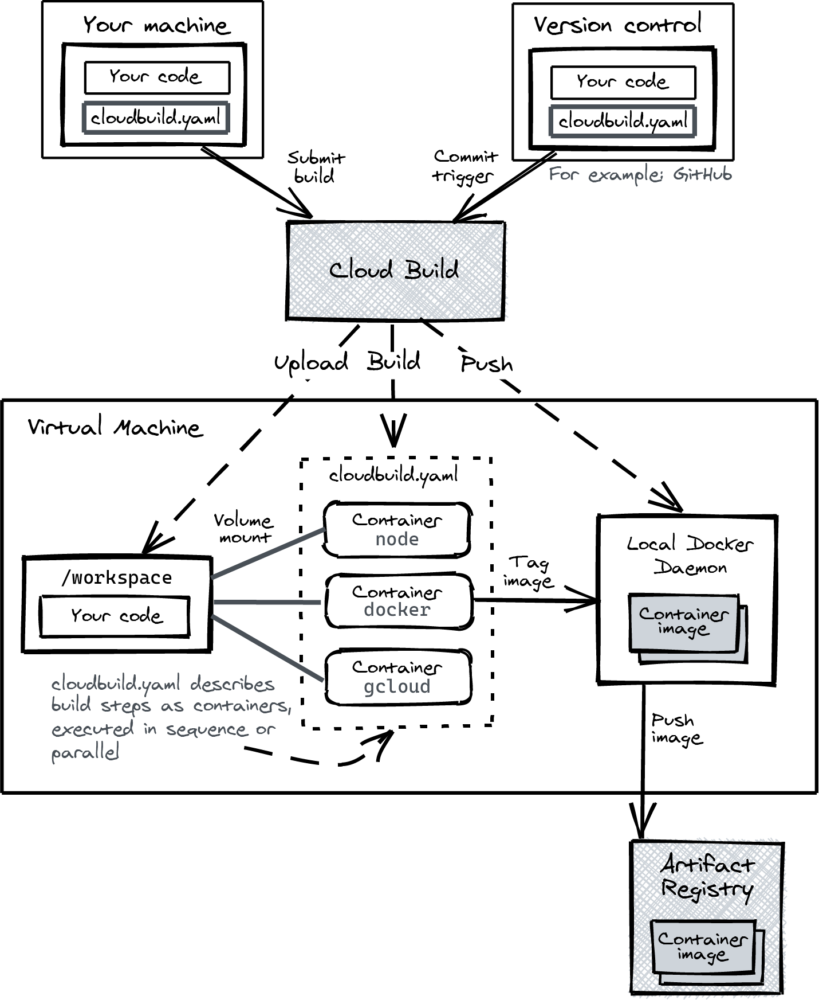

# Building serverless applications with Google Cloud Run

## Chapter 3: Building containers

### Containers from first principles

Building a Go test container to see the differences in size when building with a distroless base image.

```bash

```bash
docker build . --tag hello-go -f Dockerfile.simple
docker build . --tag hello-go-multistage -f Dockerfile
docker image ls | grep hello-go -> Compare the image size
```

### Artifact Registry

Enabling the service and creating a repository to store the images.

```bash
gcloud services enable artifactregistry.googleapis.com

gcloud artifacts repositories create \
  --location us \
  --repository-format docker \
  cloud-run-book

PROJECT=$(gcloud config get-value project)
IMAGE=us-docker.pkg.dev/$PROJECT/cloud-run-book/hello
docker build . -t $IMAGE -f Dockerfile
```

Authenticating with the registry.

```bash

gcloud auth configure-docker us-docker.pkg.dev

WARNING: Your config file at [/home/alejandro/.docker/config.json] contains these credential helper entries:

{
  "credHelpers": {
    "asia.gcr.io": "gcloud",
    "eu.gcr.io": "gcloud",
    "gcr.io": "gcloud",
    "marketplace.gcr.io": "gcloud",
    "staging-k8s.gcr.io": "gcloud",
    "us.gcr.io": "gcloud"
  }
}
Adding credentials for: us-docker.pkg.dev
After update, the following will be written to your Docker config file located at [/home/alejandro/.docker/config.json]:
 {
  "credHelpers": {
    "asia.gcr.io": "gcloud",
    "eu.gcr.io": "gcloud",
    "gcr.io": "gcloud",
    "marketplace.gcr.io": "gcloud",
    "staging-k8s.gcr.io": "gcloud",
    "us.gcr.io": "gcloud",
    "us-docker.pkg.dev": "gcloud"
  }
}

Do you want to continue (Y/n)?
```

Deploying the image to Cloud Run.

```bash
gcloud run deploy hello-world \
  --image $IMAGE \
  --allow-unauthenticated
```

### Building a container without a Dockerfile

#### Go containers with ko

ko is a tool for building Go applications into containers.

```bash
go install github.com/google/ko@latest

export KO_DOCKER_REPO=us-docker.pkg.dev/$PROJECT/cloud-run-book

ko publish -P github.com/wietsevenema/hello-docker-go
```

Describe the service deployed.

```bash
gcloud run services describe hello-world --format yaml
```

```yaml
apiVersion: serving.knative.dev/v1
kind: Service
metadata:
  annotations:
    client.knative.dev/user-image: us-docker.pkg.dev/training-363310/cloud-run-book/hello
    run.googleapis.com/client-name: gcloud
    run.googleapis.com/client-version: 403.0.0
    run.googleapis.com/ingress: all
    run.googleapis.com/ingress-status: all
    run.googleapis.com/operation-id: 27ac51aa-05a2-4e49-914d-0c898d262206
    serving.knative.dev/creator: alejandro.aceituna@intelygenz.com
    serving.knative.dev/lastModifier: alejandro.aceituna@intelygenz.com
  creationTimestamp: '2023-02-21T08:27:57.987904Z'
  generation: 1
  labels:
    cloud.googleapis.com/location: europe-west4
  name: hello-world
  namespace: '382004453183'
  resourceVersion: AAX1MY74mm4
  selfLink: /apis/serving.knative.dev/v1/namespaces/382004453183/services/hello-world
  uid: ba68ea5a-c428-4bab-a299-ad18b5496c37
spec:
  template:
    metadata:
      annotations:
        autoscaling.knative.dev/maxScale: '100'
        client.knative.dev/user-image: us-docker.pkg.dev/training-363310/cloud-run-book/hello
        run.googleapis.com/client-name: gcloud
        run.googleapis.com/client-version: 403.0.0
      name: hello-world-00001-poz
    spec:
      containerConcurrency: 80
      containers:
      - image: us-docker.pkg.dev/training-363310/cloud-run-book/hello
        ports:
        - containerPort: 8080
          name: http1
        resources:
          limits:
            cpu: 1000m
            memory: 512Mi
      serviceAccountName: 382004453183-compute@developer.gserviceaccount.com
      timeoutSeconds: 300
  traffic:
  - latestRevision: true
    percent: 100
status:
  address:
    url: https://hello-world-j6lupchraa-ez.a.run.app
  conditions:
  - lastTransitionTime: '2023-02-21T08:28:04.413038Z'
    status: 'True'
    type: Ready
  - lastTransitionTime: '2023-02-21T08:28:04.086706Z'
    status: 'True'
    type: ConfigurationsReady
  - lastTransitionTime: '2023-02-21T08:28:04.413038Z'
    status: 'True'
    type: RoutesReady
  latestCreatedRevisionName: hello-world-00001-poz
  latestReadyRevisionName: hello-world-00001-poz
  observedGeneration: 1
  traffic:
  - latestRevision: true
    percent: 100
    revisionName: hello-world-00001-poz
  url: https://hello-world-j6lupchraa-ez.a.run.app
```

The final line of output from the publish command is the image URL—it’s the value of KO_DOCKER_REPO with the package import path appended.

```bash
gcloud services enable cloudresourcemanager.googleapis.com

ko resolve -f service.yml | gcloud run services replace -

gcloud run services add-iam-policy-binding hello-world --member=allUsers --role=roles/run.invoker
```

#### Java containers with Jib

https://github.com/GoogleContainerTools/jib

Jib integrates with Maven and Gradle to build containers. If you have an existing Java project with a main class, the only thing needed to containerize your app is to add the Jib plug-in to your pom.xml or build.gradle files, and you are ready to build a container.

Building a container 

```bash
mvn compile jib:dockerBuild
```

A project from Oracle, GraalVM, allows you to create standalone native binaries from your Java source code. However, GraalVM can break existing frameworks and libraries. I suggest you explore Micronaut for GraalVM or Quarkus to get started with the new-and-improved Java.


#### Cloud Native Buildpacks

https://buildpacks.io/docs/tools/pack/
https://github.com/GoogleCloudPlatform/buildpacks
https://github.com/buildpacks/samples/tree/main/apps

```bash
pack build --builder gcr.io/buildpacks/builder:v1 hello-buildpack
```

We specified a builder. A builder contains a list of Buildpacks, each specific to a language. Because we run it in a directory with Go source code, the Go buildapck activates.

### Cloud Build

This is the Google service to build container images remotely.

This command first sends the local directory to Cloud Build, then executes docker build using a GCP VM, and finally pushes the image to a Container Registry.

```bash
PROJECT=$(gcloud config get-value project)
REPO=us-docker.pkg.dev/$PROJECT/cloud-run-book

gcloud builds submit --tag $REPO/hello-cloud-build

gcloud run deploy hello-cloud-build \
  --image $REPO/hello-cloud-build \
  --allow-unauthenticated
```

#### Advanced Builds

Insert image in markdown



A `cloudbuild.yaml` can be used to configure the build. Here are some examples of steps you can put in a cloudbuild.yaml file:

- Install dependencie- 
- Run static code analysis–style checks, detect common error pattern- 
- Run unit test- 
- Compile or package your application source- 
- Package the binary and other assets into a container imag- 
- Run component tests on the container imag- 
- Deploy the container to Cloud Run

## Cleanup

```bash
gcloud run services list
gcloud run services delete SERVICE
```