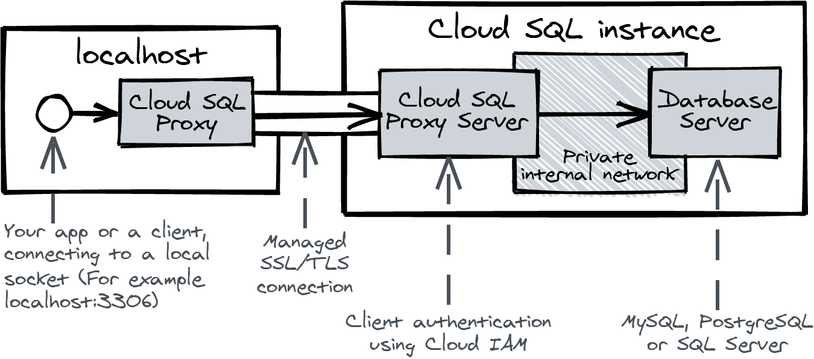
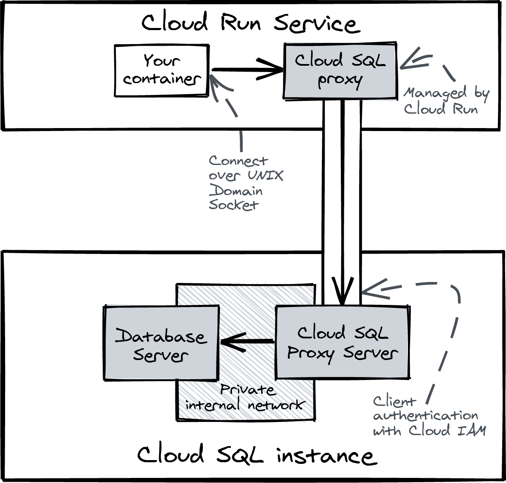
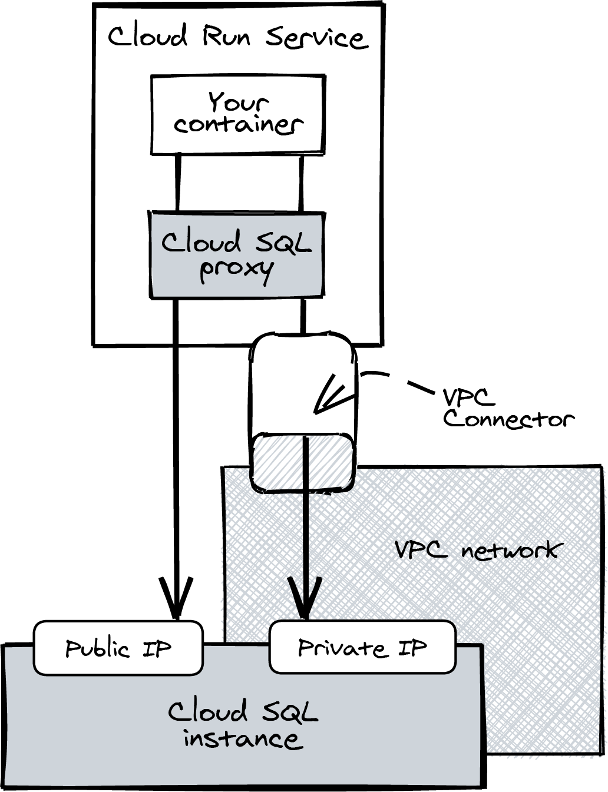
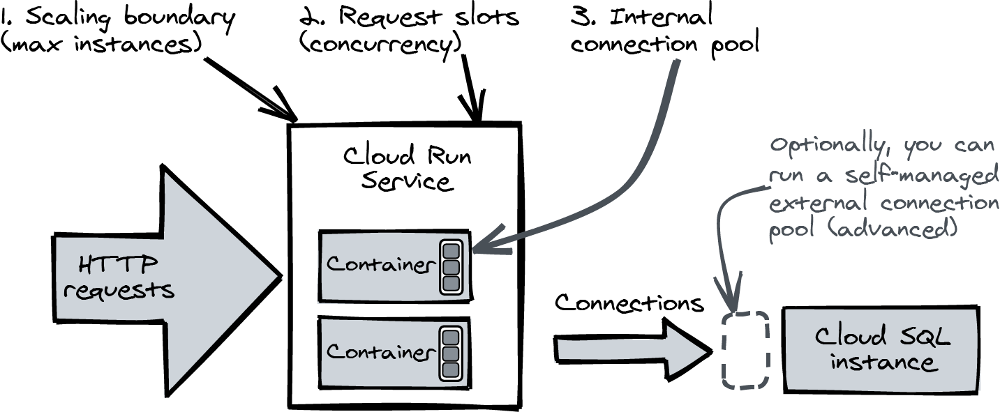

# Working with a relational database

This is what you will do:

- Set up the prerequisites
- Create a MySQL Cloud SQL instance
- Connect to Cloud SQL to initialize the schema
- Deploy the demo application to Cloud Run.

## Creating the Cloud SQL Instance

Activate Cloud SQL in the project

```bash
gcloud services enable sqladmin.googleapis.com
gcloud services enable sql-component.googleapis.com
```

Set the default region

```bash
gcloud config set sql/region europe-west4
```

Create a MySQL 8.0 instance with the smallest machine possible

```bash
gcloud sql instances create sql-db \
  --tier db-f1-micro \
  --database-version MYSQL_8_0 \
  --region europe-west4
```

Creating the DB can take too long, and the command will return as it would have failed, but we can keep tracking the creation process with the following command:

```bash
sudo /usr/local/google-cloud-sdk/bin/gcloud components install beta

gcloud beta sql operations wait --project training-363310 9d92bb93-d20d-4645-90c3-d03600000036


[Cloud SQL pricing](https://cloud.google.com/sql/pricing)

To connect to Cloud SQL, we use [Cloud SQL Proxy](https://cloud.google.com/sql/docs/mysql/sql-proxy). It is a program that makes use of Cloud IAM to bin a role to an identity (user account). A Cloud Run service has assigned an identity, a service account (non-personal (robot) identities in GCP).

The role that Cloud SQL Proxy uses is "Cloud SQL Client". This role is assigned to the Cloud Run service account. If an identity has this role, it can connect to all Cloud SQL databases.



### Connecting and Loading the Schema

Install the Cloud SQL Proxy and the MySQL client

```bash
# This method didn't work for me
sudo /usr/local/google-cloud-sdk/bin/gcloud components install cloud_sql_proxy

sudo apt-get install mysql-client
```

Now we can connect to the Cloud SQL instance

```bash
gcloud beta sql connect sql-db --user root
```

We can keep the password empty for the root user, and show the databases

```sql
mysql> show databases;
+--------------------+
| Database           |
+--------------------+
| information_schema |
| mysql              |
| performance_schema |
| sys                |
+--------------------+
4 rows in set (0.13 sec)
```

Now we are going tyo load the schema. First, we create a `todo` database

```bash
gcloud sql databases create todo --instance sql-db
```

And now we can load the schema

```bash
# pwd
# /home/alejandro/study/gcp/building-serverless-applications-with-google-cloud-run/my-notes/4-working-with-a-relational-database/todo

gcloud beta sql connect sql-db --user root < schema.sql
```

### Securing the default user

To get a list of users of the DB

```bash
gcloud sql users list --instance sql-db
```

Even though we are behind a proxy, we are going to remove that superuser

```bash
gcloud sql users delete root --host % --instance sql-db
```

And now recreate the user on the DB which can only login through the proxy

```bash
gcloud sql users create root \
  --host "cloudsqlproxy~%" \
  --instance sql-db
```

This is the difference when listing the old and new users

```bash
# old
NAME  HOST  TYPE      PASSWORD_POLICY
root  %     BUILT_IN  {'status': {}}

# new
NAME  HOST             TYPE      PASSWORD_POLICY
root  cloudsqlproxy~%  BUILT_IN  {'status': {}}
```

The `--host` flag restrict the user to only login through the network called `cloudsqlproxy`.Now we are sure that the login originates from an identity with the Cloud IAM role "Cloud SQL Client".

### Connecting Cloud Run to Cloud SQL

You can connect a Cloud Run service to Cloud SQL using the flag `--add-cloudsql-instances`, which will add a special file to the container in `/cloudsql/` with the connection details.

This file is a UNIX Domain Socket



### Disabling the direct connection

The other way to connect Cloud Run to Cloud SQL is through a direct connection, which is not recommended. This is because the connection will not be encrypted by default. You can require SSL/TLS, but you'll need to generate and maintain certificates. The direct connection will always bypass Cloud IAM.

Even when not using Direct Connection, you can still require SSL/TLS

```bash
gcloud sql instances patch --require-ssl sql-db

The following message will be used for the patch API method.
{"name": "sql-db", "project": "training-363310", "settings": {"ipConfiguration": {"requireSsl": true}}}
Patching Cloud SQL instance...done.                                                                                                                                                                                                           
Updated [https://sqladmin.googleapis.com/sql/v1beta4/projects/training-363310/instances/sql-db].
```

### Deploying the demo application

Using the Chapter 3 app Artifact Repository, but this folder source code

```bash
PROJECT=$(gcloud config get-value project)
IMAGE=us-docker.pkg.dev/$PROJECT/cloud-run-book/todo

gcloud builds submit --tag $IMAGE
```

And now we can deploy the app

```bash
REGION=europe-west4
DB_INSTANCE=$PROJECT\:$REGION\:sql-db

gcloud run deploy todo \
  --add-cloudsql-instances $DB_INSTANCE \
  --image $IMAGE \
  --region $REGION \
  --allow-unauthenticated \
  --set-env-vars DB="mysql://root@unix(/cloudsql/$DB_INSTANCE)/todo"
```

We can get into the URL to see the apworking and fill it with random todos.

We can check if those todos shows up in the DB

```bash
gcloud beta sql connect sql-db --user root
Starting Cloud SQL Proxy 
[..SNIP..]
mysql> SELECT * FROM todo.todos;
```

### Public and Private IP

If you deploy Cloud SQL only with a private IP, it will be accessible using VPC Connector.



## Limiting Concurrency

A traditional relational DB can hande 10_000 of connections per seconds, but it doesn't do well when transaction concurrency, the number of queries that the DB server is handling at the same time, goes beyond 200.

Cloud Run can scale up quickly to one thousand instances ore more and overload the DB.

### Transaction Concurrency

Transaction rate is expressed as transactions completed per second (TPS).


The chart shows what happens when you start to increase transaction concurrency by adding more clients. At first, as concurrency increases, transaction rate steadily increases. However, at some point, the transaction rate curve starts to level out toward a maximum as transaction duration starts to increase. At some point, the transaction rate can even begin to decrease when transaction timeouts start to happen and new connections are refused.

### Resource contention

Resource contention happensa when multiple transactions want to use a shared resource at the same time. A shared resource can be data (such a row, table or index) or system resources (such as CPU, memory, disk, or network bandwidth). The system needs to spend additional processing time resolving resource contention, increasing the duration of transactions.

Locks are a common cause of resource contention. If a transaction needs exclusive access to a piedceof data, the DB engine locks the data, making any otheer transaction wait.

### Scaling boundaries and Connection Pooling

There are two ways to limit concurrency using standard settings.



The scaling boundary of Cloud Run is the first control. It limits the max number of containers that Cloud Run will add, which in turn limits the amount of HTTP request that can be handled concurrently.

This command sets the max number of containers to 100 fo the service named `todo`

```bash
gcloud run services update todo \
  --max-instances 100
```

If all containers are in use, requests will be held in the request queue until a request slot frees up on a container.

From the application perspective, the internal connection pool maintains long-running connections to the DB server. If the app wants to send a query, it borrows a connection from the pool exclusively and returns the connection when it is done.

```go
db.SetMaxOpenConns(2)
```

This will limit the total number of active connections to Cloud SQL to max instances * 2.

### Advanced setup: using an external connection pool

An advanced setup consist on setting up an external connection pool, such as [pgbouncer](https://www.pgbouncer.org/), to limit the number of connections to the DB server.

It accepts connections from the application and forwards them to the DB server. It also maintains a pool of connections to the DB server, which it reuses for subsequent requests.

[Here's an example using Terraform](https://github.com/christippett/terraform-google-cloud-sql-pgbouncer)

## Clean up

```bash
gcloud sql instances delete sql-db
```