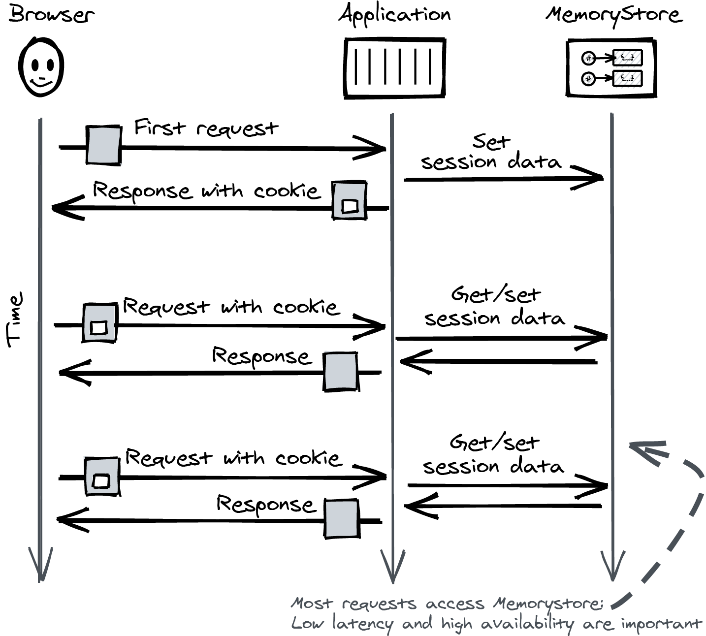
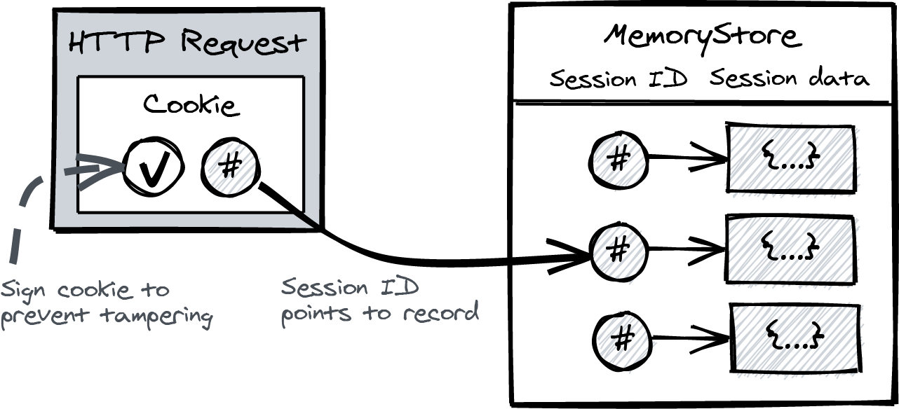
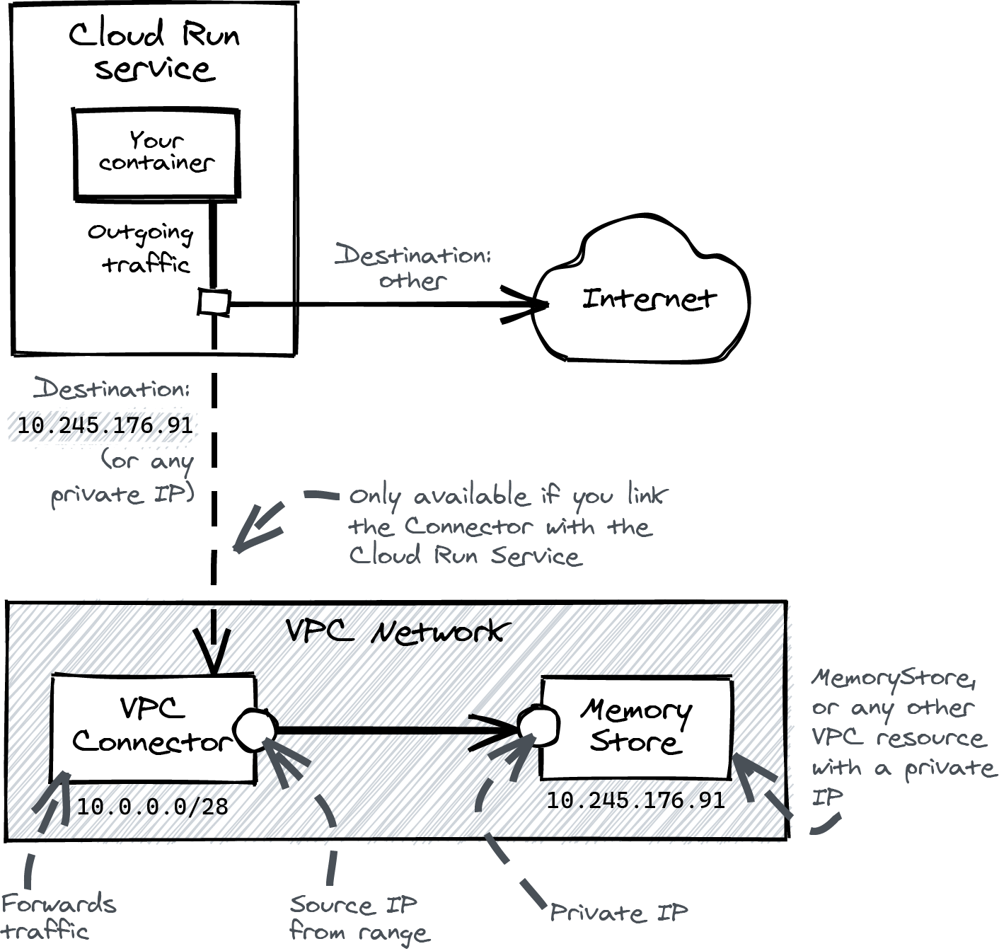
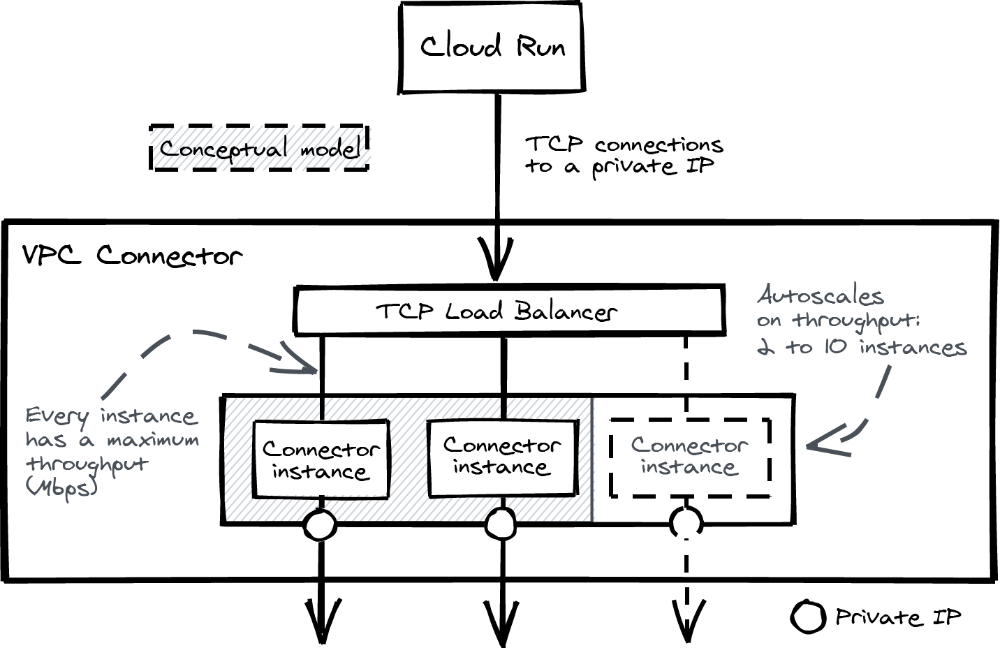

# Working with HTTP sessions

Examples of session data include the authentication status (logged in or not) and short-lived intermediate states, such as the contents of a form the user is filling in but that still has errors, or a status message the user needs to see but that can be deleted after (“flash message”).

A common choice is to use Redis. MemoryStore is the GCP managed redis. There are alternatives to it: Firestore and Cloud SQL.



I’ll start at the beginning. A new browser comes in and sends a first request to your Cloud Run service. To start a session, your application generates a cookie with a unique session ID and returns it to the client. It uses the session ID to create a record in Memorystore.

The browser saves the cookie and sends it along with every subsequent request, which lets your application identify the user through the unique session ID and get the session data from Memorystore.

The cookie contains a session ID and a cryptographic signature. You don’t want your user to change the session ID to a different ID and steal someone else’s session, which is why it is common practice to sign the cookie.

If you care about the security of your sessions, you should also set the attributes Secure, HttpOnly, and SameSite=Strict. The [MDN documentation](https://developer.mozilla.org/en-US/docs/Web/HTTP/Cookies) explains this better than I can.



In this chapter we are going to run the Chapter 4 example, but storing both todo items and session data in MemoryStore.

## Creating a Memorystore instance

Enable the Memorystore API

```bash
gcloud services enable redis.googleapis.com
```

Create a Memorystore instance

```bash
gcloud redis instances create \
  my-instance \
  --tier basic \
  --size 1 \
  --region europe-west4
```

Tier:

- basic: single instance
- standard: two instances, one being a standby replica

Size: amount of memory in gigabytes

A MemoryStore instance has only a private IP, which is why you need a VPC Connector to reach it.

### What is a VPC Connector?

It provides private networking for services such as MemoryStore, Cloud SQL and Compute Engine VMs. They run inside a VPC.

But Cloud Run is not part of the VPC. You need to create a VPC Connector to connect Cloud Run to the VPC.

The VPC Connector is a resource that's part of the VPC. To create it, you choose a region and an IP range with exactly 16 private IP addresses that aren't in use.



Conceptually, it behaves as an instance group with VMs behind a TCP Load Balancer. Because they're not exactly the same as VMs, we can call them connector instances.

If a connector instance receives traffic from Cloud Run, it forwards it to the destination (a private IP in the VPC), replacing the source IP address with its own IP address. The source IP address is the one out of the range of 16 private IP addresses that are allocated to the VPC connector.



Every connector instance can handle a limited amount of network traffic in Mbps, and the VPC Connector automatically scales up when the throughput is too high. The minimum number of connector instances is 2, and the maximum is 10, which can set when the VPC connector is created.

## Creating a VPC Connector

Enable the VPC Connector API

```bash
gcloud services enable vpcaccess.googleapis.com
```

Deploy the VPC Connector

```bash
gcloud compute networks vpc-access connectors \
   create my-connector \
     --region europe-west4 \
     --range 10.0.0.0/28
```

## Deploying the application

Get the MemoryStore instance IP address

```bash
gcloud redis instances list --region europe-west4
```

Deploy the application specifiying the MemoryStore instance IP address and the VPC Connector name

```bash
PROJECT=$(gcloud config get-value project)
IMAGE=us-docker.pkg.dev/$PROJECT/cloud-run-book/todo
REGION=europe-west4
REDIS_IP=10.252.132.107

gcloud run deploy todo \
  --image $IMAGE \
  --region $REGION \
  --allow-unauthenticated \
  --set-env-vars DB="redis://$REDIS_IP:6379"\
  --vpc-connector my-connector
```

## Alternative Session Stores

There are three alternatives on Google Cloud: Cloud SQL, Memorystore, and Firestore. Here’s an overview of their key characteristics:

Memorystore
    Memorystore is the managed Redis database you used in this chapter. It has low-latency key access and a service-level agreement (SLA) of 99.9%, with no more than around 44 minutes of downtime every month (downtime of less than a minute is not counted). Memorystore is not serverless, and you are billed for active instances.
Cloud SQL
    You already know Cloud SQL from the previous chapter. It’s the product that manages either MySQL, PostgreSQL, or SQL Server for you. The SLA is 99.95% for the high-availability setup, which comes down to 22 minutes of downtime in a month (not counting less than a minute). Memorystore and Firestore are better at handling concurrency.
Firestore
    Finally, Firestore is the autoscaling, fully managed, and proprietary key-value store. It offers regional availability by default, and there is no operational management. There is regional or even multiregional support (in some locations). The SLA comes down to no more than 26.3 seconds of downtime monthly in the multiregional configuration. The latency of Memorystore is better, but the reliability of Firestore is hard to beat. Firestore also features a serverless pay-per-use pricing model. 

## Clean up

Delete the Redis instance

```bash
gcloud redis instances delete my-instance --region europe-west4
```

Show the VPC Connector

```bash
gcloud compute networks vpc-access connectors list --region=europe-west4
```

Delete the VPC Connector

```bash
gcloud compute networks vpc-access connectors \
  delete my-connector \
  --region=europe-west4
```
