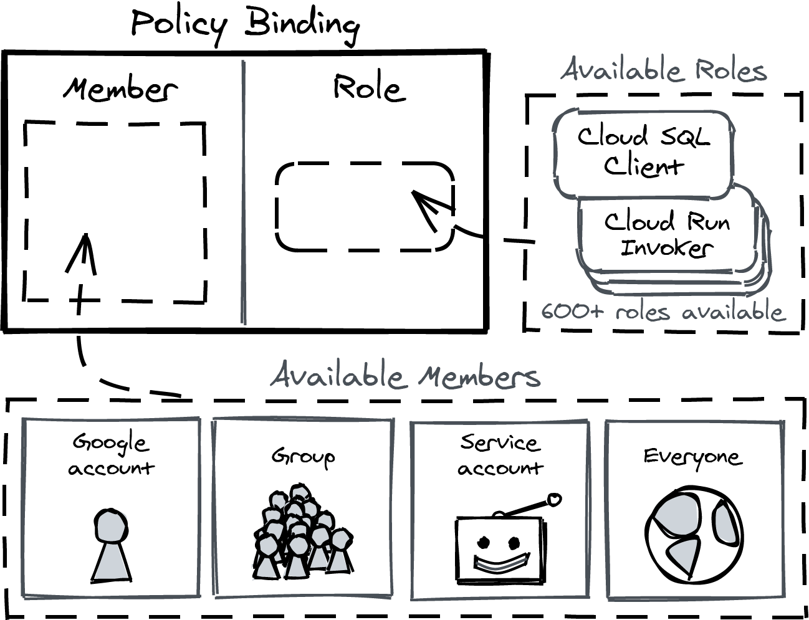
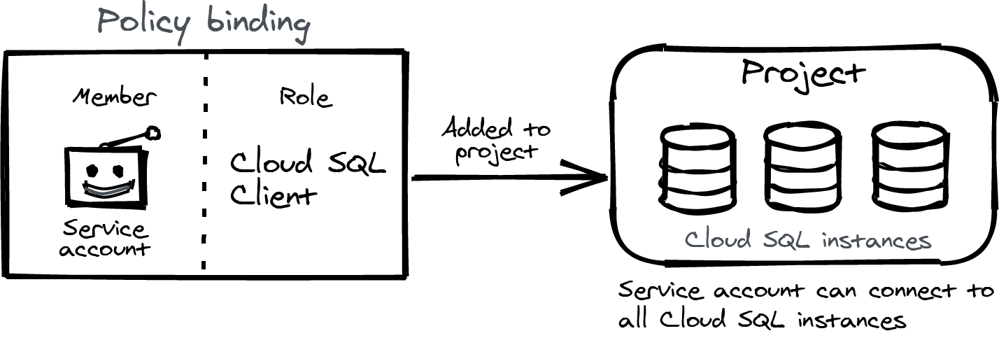
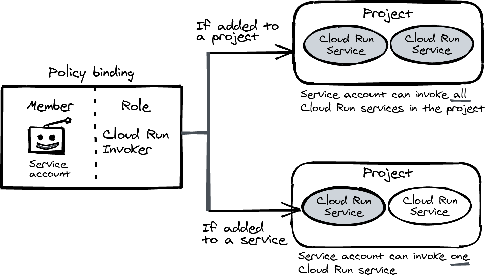
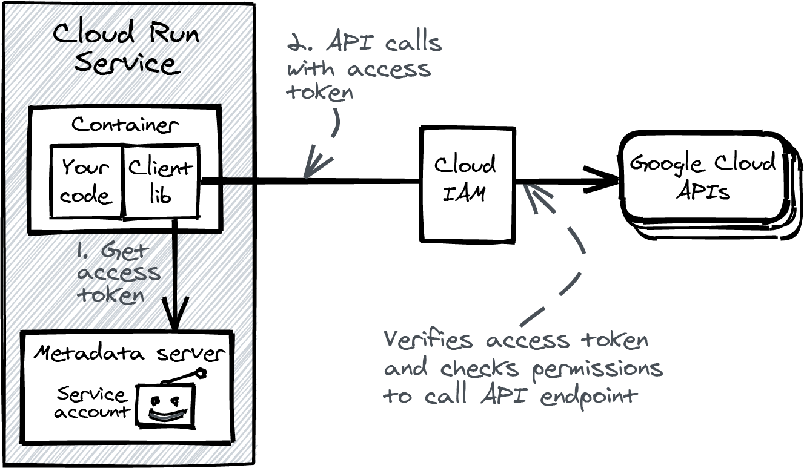
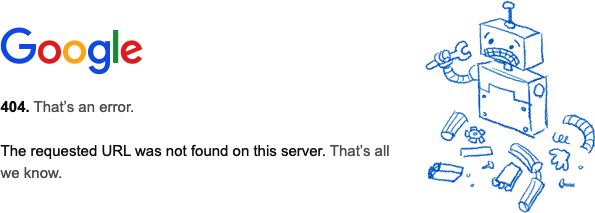
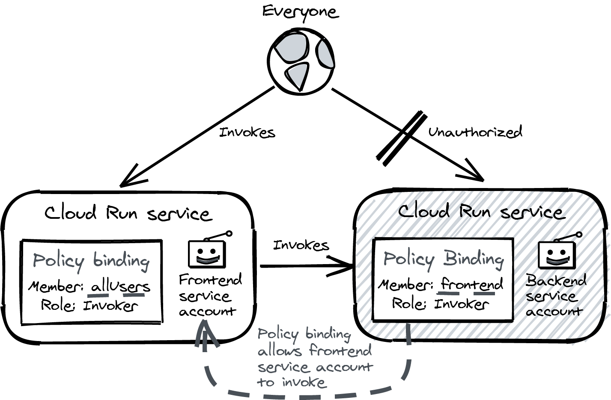
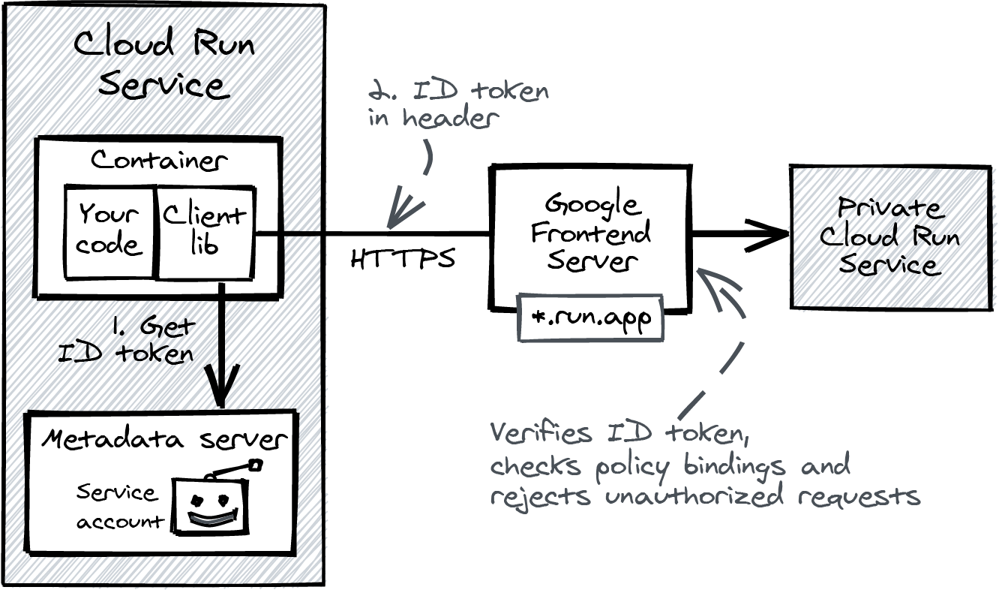
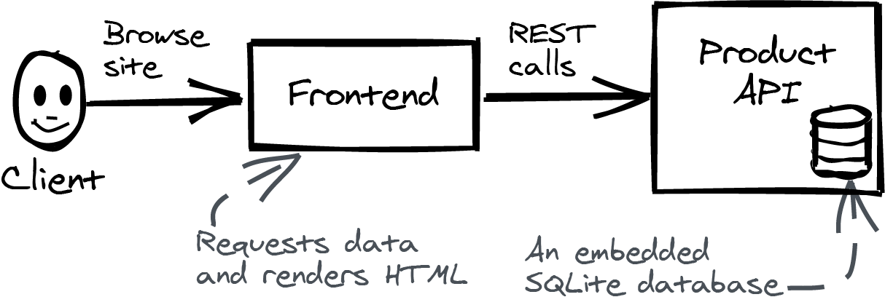

# Service Identity and Authentication

## Roles

Permissions are tied to a specific API endpoint, and granularly determine what operations can be performed on a resource.

[Here is a complete reference of roles](https://cloud.google.com/iam/docs/understanding-roles)

Some relevant roles are:

- Storage Object Admin: full control over the objects in a GCS bucket.
- Cloud Tasks Enqueuer: create tasks in Cloud Tasks.
- Cloud SQL Client: connect to a Cloud SQL instance through the Cloud SQL proxy.
- Cloud Run Invoker: can invoke a Cloud Run service.

## Policiy Binding

It binds a member to a role, being a member a Google account, a group of Google accounts, a service account or the special group `AllUsers`, which represents everyone on the internet. This broad open group is specially useful for the role Cloud Run Invoker; if you want to make a service publicly accessible, this is the member you should bind to.



### Adding a policy binding to a project



```bash
gcloud projects add-iam-policy-binding [PROJECT] \
  --member serviceAccount:[SERVICE-ACCOUNT] \
  --role roles/cloudsql.client
```

### Adding a policy binding to a resource

The previous binding can only be added to a project. But some roles offer more granular assignment to individual resources, like Cloud Run Invoker. This bindings involving this role can be added to a project and to a service



This is how you add a binding with the Cloud Run Invoker role to a specific service (a specific Cloud Run service)

```bash
gcloud run services add-iam-policy-binding [SERVICE] \
  --member serviceAccount:[SERVICE-ACCOUNT] \
  --role=roles/run.invoker
```

When you deploy a Cloud Run service with the flag `--allow-unauthenticated`, it automatically adds the Cloud Run Invoker role to the special member `AllUsers`. This is the same as adding the following binding:

```bash
gcloud run services add-iam-policy-binding [SERVICE] \
  --member=AllUsers \
  --role=roles/run.invoker
```

You can inspect the binding with the following command:

```bash
gcloud run services get-iam-policy hello
bindings:
- members:
  - allUsers
  role: roles/run.invoker
etag: BwWvkVmZb-Y=
version: 1
```

## Service Accounts

We have covered how to give permissions ON a Cloud Run service. This section cover the permission OF a Cloud Run service.

A Cloud Run service always has a service account (its non-personal identity on GCP). When you make a call to a Cloud API from within the container, the Google Cloud Client Library asks the service account through the metadata server to create an access token and sends it along with the API call. An access token is a cryptographic proof of identity. Cloud IAM verifies the access token and checks policy bindings before it forwards the call.



If you don't specify a service account when you deploy a Cloud Run service, it automatically creates one for you. This service account has the role Cloud Run Invoker, which allows it to be invoked by anyone.

### Avoiding the default service account

The default service account has the Project Editor role binding, which is too broad. You should avoid using it.

```bash
$: gcloud iam roles describe roles/editor
description: Edit access to all resources.
etag: AA==
includedPermissions:
- accessapproval.requests.get
- accessapproval.requests.list
...edited: over 3000 permissions listed here...
- workflows.workflows.list
- workflows.workflows.update
name: roles/editor
stage: GA
title: Editor
```

Let's suppose you hve an application with a big red button (the repo in this folder) deployed with the default service account linked to it. Let's deploy it.

```bash
gcloud run deploy shutdown \
  --image gcr.io/cloud-run-book/shutdown \
  --allow-unauthenticated
```

When clicking the button, the app made an API call to the Cloud Run management API. Cloud IAM authenticated the caller as the default service account and found a project-level binding with the role Editor, which means it is granted permission to delete the service.



### Creating and using a custom service account

You need to create a new service account, attach it to the Cloud Run service, and carefully manage its permissions using policy bindings.

```bash
gcloud iam service-accounts create shutdown-svc \
  --display-name "Shutdown service account"
```

To list all service accounts in your project:

```bash
gcloud iam service-accounts list
```

You can now deploy the app again, but this time with the new service account.

```bash
gcloud run deploy shutdown \
  --image gcr.io/cloud-run-book/shutdown \
  --allow-unauthenticated \
  --service-account shutdown-svc@[PROJECT].iam.gserviceaccount.com
```

The Cloud Run service is not able to delete itself anymore.

## Sending authenticated requests to Cloud Run

We have 2 services:

- The frontend service has a policy binding that allows public traffic. It has an assigned SA _frontend_, which is used in the policy binding added to the backend service.
- The backend service allows only incoming calls from the frontend service.



### Deploying a private service

We will deploy the service from Chapter 2 allowing only authenticated requests.

```bash
gcloud run deploy private-svc \
  --image gcr.io/cloud-run-book/inspect \
  --no-allow-unauthenticated
```

Sending a request will throw an error "Your client does not have permissions"

```bash
curl https://private-svc-[XXX].run.app
```

### Using an ID Token to send authenticated requests

An ID token is an encoded JSON object with cryptographic signature. It holds proof of your identity and is valid for a limited time.

To get a token:

```bash
gcloud auth print-identity-token
```

This command allows access to all ID token-enabled Google services on your behalf for an hour. 

To parse the token locally we can use [this tool](https://github.com/wietsevenema/oidc)

```bash
gcloud auth print-identity-token | oidc

{
  "Header": {
    "alg": "RS256",
    "kid": "d25f8dbcf97dc7ec401f0171fb6e6bda9ed9e792",
    "typ": "JWT"
  },
  "Claims": {
    "at_hash": "VkW5YHuh7nhcFDeJfrS-Xg",
    "aud": "32555940559.apps.googleusercontent.com",
    "azp": "32555940559.apps.googleusercontent.com",
    "email": "alejandro.aceituna@intelygenz.com",
    "email_verified": true,
    "exp": 1677484871,
    "hd": "intelygenz.com",
    "iat": 1677481271,
    "iss": "https://accounts.google.com",
    "sub": "118116452377014095702"
  }
}
```

#### When is an ID token valid?

- The signature is valid and signed by Google
- The audience field matches the service you are calling, or it is a valid client ID in the case of an ID token from gcloud
- The token has not expired (tokens are valid for one hour at most- 
- There is a matching policy binding that allows the service account or user to invoke the service

## Programatically calling private Cloud Run services

To send requests from one Cloud Run service to another, you'll also need to pass the ID token in an HTTP header. You can use this [Golang package](https://github.com/googleapis/google-api-go-client)

```go
audience := "https://private-svc.XXX.a.run.app"
client, err := idtoken.NewClient(context, audience)
resp, err := client.Get("https://private-svc.XXX.a.run.app/hello")
```

It returns an HTTP client you can use to send authenticated requsts to the private service. The token will be attached and refreshed before it exprires, so you can reuse the client. You can only use this client to send requests to the service you specified as the _audience_.




## Google Frontend Server

You use the public HTTPS URL when making a request to another Cloud Run service. This means it will land on a Google Frontend (GFE) Server first.

The Google Frontend is a decentralized component that provides the first point of entry for every HTTPS request to Google Cloud. This is what it does:

- It centralizes and enforces TLS best practices, making sure your HTTPS connection is really safe- 
- It protects against denial-of-service attacks (up to and including the transport layer)- 
- It inspects and checks authorization headers, rejecting unauthorized requests- 
- It deletes reserved HTTP headers. For example, the header X-CloudTasks-QueueName is used internally, so it will be removed from incoming requests.

You should not think of the GFE as a security perimeter in the traditional sense.

Google assumes the internal network is always unsafe. When the GFE server is done processing the request, it will forward it, using Google's internal RPC framework, to your container on Cloud Run.

## Demo Application



Running locally (from the product folder)

```bash
docker-compose up --detach --build
```

### Deploying the frontend

First, build both containers and deploy them to Cloud Run. From the root directory of the repository, run this to deploy the frontend, allowing public access.

```bash
PROJECT=$(gcloud config get-value project)
FRONTEND_IMAGE=us-docker.pkg.dev/$PROJECT/cloud-run-book/frontend

gcloud builds submit frontend \
  --tag $FRONTEND_IMAGE

gcloud run deploy frontend \
  --image $FRONTEND_IMAGE \
  --allow-unauthenticated
```

If you open the frontend.*.run.app URL, you should see an error about the missing product API configuration. Build and deploy the product API so you can update the configuration of the frontend service. This time, don’t allow unauthenticated traffic.

```bash
PRODUCT_IMAGE=us-docker.pkg.dev/$PROJECT/cloud-run-book/product-api

gcloud builds submit product-api \
  --tag $PRODUCT_IMAGE

gcloud run deploy product-api \
  --image $PRODUCT_IMAGE \
  --no-allow-unauthenticated
```

If you open the product-api.*.run.app URL, you will see “Error: Forbidden.” This is exactly how it should be because calls to the product API should be restricted to the frontend only.

You now need to update the service to add the URL of the product API. Copy the product-api.*.run.app URL from your output and change the configuration. This time, you’re only changing the configuration, so the container image doesn’t need to be rebuilt

```bash
gcloud run services update frontend \
  --set-env-vars PRODUCT_API=[YOUR-PRODUCT-API-URL]
```

Open the frontend.*.run.app URL again and you should now see a list of random products. This means the frontend was able to send authenticated calls to the product API.

However, you’re not done yet. Both services run with the powerful default service account.

### Add Custom Service Accounts

Create 2 service accounts:

```bash
gcloud iam service-accounts create frontend
gcloud iam service-accounts create product-api
```

Redeploy both services and add their respective service accounts

```bash
PROJECT=$(gcloud config get-value project)

gcloud run services update frontend \
  --service-account frontend@$PROJECT.iam.gserviceaccount.com

gcloud run services update product-api \
  --service-account product-api@$PROJECT.iam.gserviceaccount.com
```

If you now open the frontend.*.run.app URL again, it will show an error because the frontend is not authorized to invoke the product API. Add a policy binding on the product API and allow the frontend to send requests

```bash
gcloud run services add-iam-policy-binding \
  product-api \
  --member serviceAccount:frontend@$PROJECT.iam.gserviceaccount.com \
  --role roles/run.invoker
```

