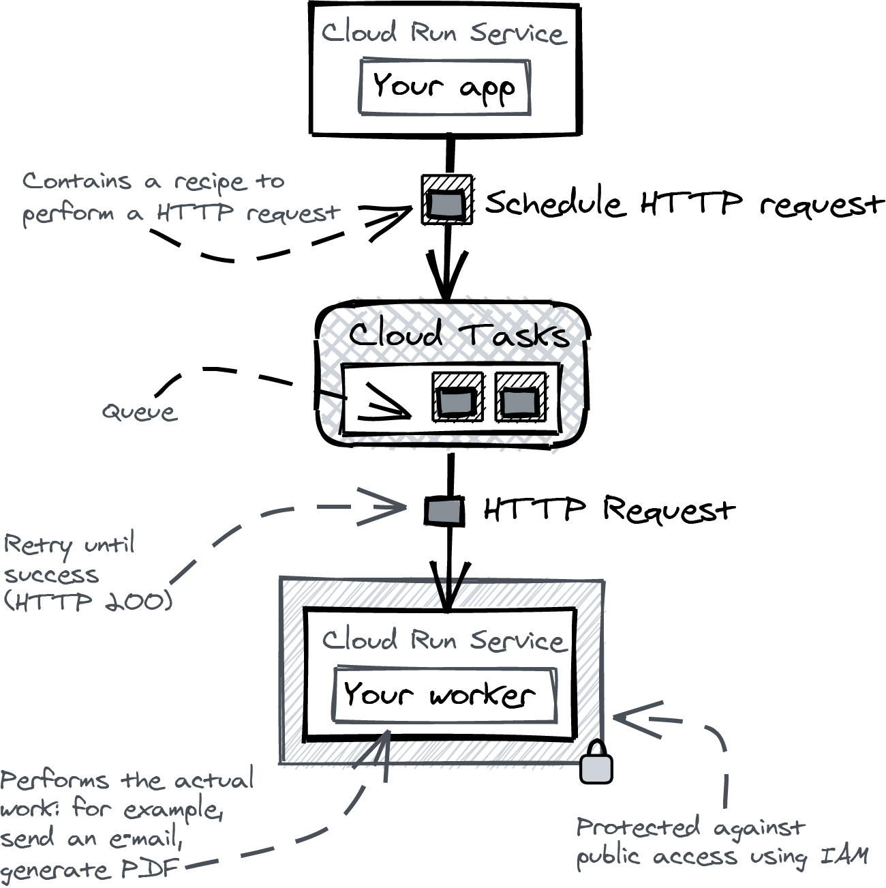
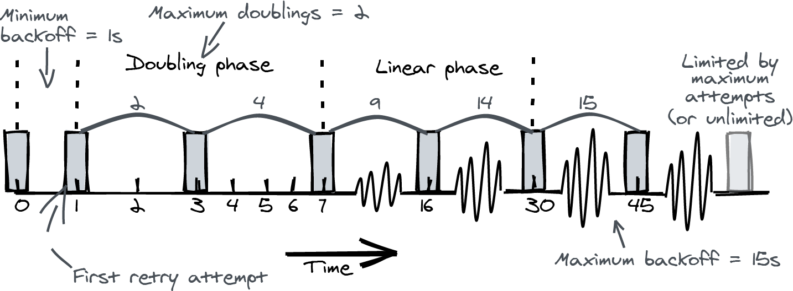

# Task Scheduling

Most applications need to schedule tasks to be executed later, either immediately after handling an HTTP request or after a delay. In this chapter, I’ll show you how to handle task scheduling on Cloud Run—because the usual approaches won’t work like you expect.

On a traditional server, you handle these types of tasks by spawning a background thread or scheduling a cron job, but these approaches are not compatible with serverless environments like Cloud Run: the platform only guarantees CPU access while your container is handling requests, and the containers are disposable. This means your container might disappear, or lose CPU access while handling a task.

## Cloud Tasks

Cloud Tasks does not perform the task itself:

- Scheduling a task means you hand the recipe for an HTTP request to Cloud Tasks.
- Executing a task means Cloud Tasks performs the actual request for you.

Using a separate Cloud Run service as a workder brings 2 main benefits:

1. You can protect the service using IAM
2. It will scale independently from the service that schedules the tasks.



New tasks are put in a queue, a somewhat misleading term, since the tasks are not necessarily executed in the order in which they arrive. When executing the HTTP request, Cloud Tasks will retry until it is successful (2XX response).

Cloud Tasks limits are maximum request duration. It allows 10 minutes by default, which can be increased to 30 minutes. The maximum request duration is 60 minutes. The 30 minutes deadline should be enough, if not, you can split the work into pieces (for example, create 30 jobs that process 100 images each, for a total of 3000 images).

## A Demo Application

The app will consist on two services, `task-app` and `worker`. The first allow public traffic, the second is protected with IAM.

The app shows a button to schedule a task on the worker. Once scheduled, you'll have to check the logs of the worker service to learn if it received and executed the job.

### Building the container images

First, ensure the Artifact Registry we created in Chapter 3 still exists:

```bash
gcloud artifacts repositories list
```

And build the containers using Cloud Build:

```bash
PROJECT=$(gcloud config get-value project)

gcloud builds submit task-app \
  -t us-docker.pkg.dev/$PROJECT/cloud-run-book/task-app

gcloud builds submit worker \
  -t us-docker.pkg.dev/$PROJECT/cloud-run-book/worker
```

### Creating a Cloud Tasks Queue

Enable the Cloud Tasks API:

```bash
gcloud services enable cloudtasks.googleapis.com
```

And create a queue named `jobs`

```bash
gcloud tasks queues create jobs --location us-central1
```

Now create the service accounts for both services:

```bash
gcloud iam service-accounts create task-app
gcloud iam service-accounts create worker
```

Deploy the workder service. Its timeout is set at the maximum of 15 minutes, and CPU and memory are specified to ensure it has enough resources to handle the tasks. Public access is disallowed:

```bash
gcloud run deploy worker \
  --image us-docker.pkg.dev/$PROJECT/cloud-run-book/worker \
  --timeout 900 \
  --cpu 2 \
  --memory 2G \
  --service-account worker@$PROJECT.iam.gserviceaccount.com \
  --no-allow-unauthenticated
```

Also we add an IAM policy binding to make sure `task-app` service account can invoke the worker service:

```bash
gcloud run services add-iam-policy-binding worker \
  --member serviceAccount:task-app@$PROJECT.iam.gserviceaccount.com \
  --role roles/run.invoker
```

Now we deploy the Task App service:

```bash
gcloud run deploy task-app \
  --image us-docker.pkg.dev/$PROJECT/cloud-run-book/task-app \
  --service-account task-app@$PROJECT.iam.gserviceaccount.com \
  --allow-unauthenticated
```

### Connecting the task queue

The tasks app needs to know the name of the queue to send tasks to. Find out the full name of the queue describing the jobs queue:

```bash
gcloud tasks queues describe jobs --location us-central1

name: projects/training-363310/locations/us-central1/queues/jobs
rateLimits:
  maxBurstSize: 100
  maxConcurrentDispatches: 1000
  maxDispatchesPerSecond: 500.0
retryConfig:
  maxAttempts: 100
  maxBackoff: 3600s
  maxDoublings: 16
  minBackoff: 0.100s
state: RUNNING
```

And set it up as an environment variable in the tasks app:

```bash
gcloud run services update task-app \
  --update-env-vars QUEUE=projects/training-363310/locations/us-central1/queues/jobs
```

Also, make sure the service account has permission to add tasks to the queue. The `task-app` SA needs the "Cloud Tasks Enqueuer" role:

```bash
gcloud tasks queues add-iam-policy-binding "projects/training-363310/locations/us-central1/queues/jobs" \
  --member serviceAccount:task-app@$PROJECT.iam.gserviceaccount.com \
  --role roles/cloudtasks.enqueuer
```

Now you can schedule tasks with the Cloud Tasks Client Library. In the repository of this folder, there's a function `func sendTask(URL string, queueName string)`.

It contains a template for an HTTP request `taskspb.HttpRequest`. Two things to highlight:

- I'm setting a dispatch deadline (timeout) of 15 minutes.
- I set an authorization header using the service account of the Cloud Run service

### Automatic ID Token

The ID token is added by Cloud Tasks when the task is executed, not when you schedule the task. This is because the task can fail and be retried, and the ID token might expire in the meantime. The ID token is valid for 1 hour maximum.

Cloud Tasks already has the permission to generate OIDC token on behalf of any service account, but it requires the caller that creates the task, in this case `task-app`, to have the Service Account User role.

```bash
gcloud iam service-accounts add-iam-policy-binding \
  task-app@$PROJECT.iam.gserviceaccount.com \
    --member serviceAccount:task-app@$PROJECT.iam.gserviceaccount.com \
    --role roles/iam.serviceAccountUser
```

### Connecting the worker

The last piece is to set the URL of the `worker` service on the `task-app`. Find the URL:

```bash
gcloud run services list --filter metadata.name=worker
```

And update the `task-app` configuration:

```bash
gcloud run services update task-app \
  --update-env-vars WORKER_URL=https://worker-j6lupchraa-ez.a.run.app
```

### Testing the app

Opening the task-app and clicking the button will schedule a task. You can check the logs of the worker service to see if it received the task in the Web console.

## Queue configuration

### Retry configuration

When a request fails, a retry is scheduled.



The first interval is the minimum backoff (1 second in the example). Then you go into the _doubling phase_, where the next interval is double the previous interval at every attempt.

After a number of attempts (set by maximum doubling), the _linear phase_ starts, and the interval is increased every time with 2^maxDoublings + minimum backoff. In this example, the linear increase is 2^2 + 1 = 5 seconds.

The linear phase continues until the interval would exceed the maximum backoff, from where it stays constant at maximum backoff (15 seconds in the example). The attemps will continue until the maximum number of attemps is reached.

After that, Cloud Tasks forgets about the task and stops retrying. You can avoid this either setting the number of retry attemps to unlimited, or you track the completion status in a DB so you can have another process decide periodically what to do with those tasks.

### Rate limiting

This feature is specially useful for endpoints that don't scale very well. There are 2 settings:

- `maxDispatchesPerSecond`: sets the maximum rate
- `maxConcurrentDispatches`: sets the maximum number of tasks that can be executed at the same time.

The default setting of 1_000 is very high.

### Viewing and updating queue configuration

To describe a queue:

```bash
gcloud tasks queues describe jobs --location us-central1
```

To update the queue:

```bash
gcloud tasks queues update jobs --location us-central1 \
  --max-dispatches-per-second 100 \
  --max-concurrent-dispatches 100 \
  --max-attempts 10 \
  --max-backoff 15s \
  --max-doublings 3 \
  --min-backoff 1s
```
