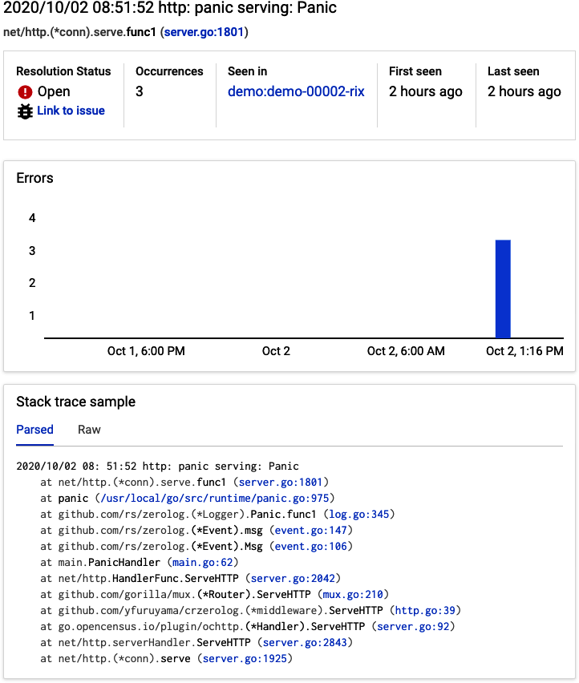
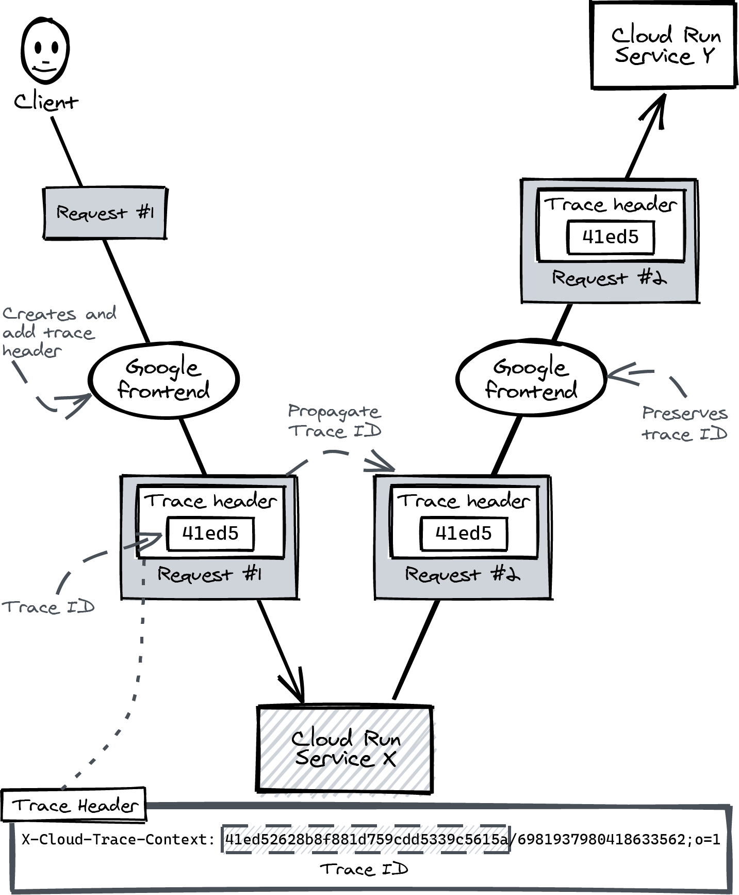
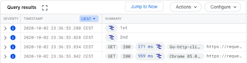

# Structured logging and tracing

Tail logs from the terminal from the last log from any Cloud Run service in the project:

```bash
gcloud logging read "resource.type=cloud_run_revision" --limit 1
```

Cloud Monitoring tracks metrics so you can create charts and set up alerts.
Error Reporting finds stack traces in your logs and keeps track of how often they happen.
Cloud Trace collects latency data from requests and helps you find performance issues.

There are several [client libraries](https://cloud.google.com/logging/docs/reference/libraries) to log to Cloud Logging from your application. You write logs using the library, which buffers the logs in memory and sends them to the Cloud Logging API periodically (push model). You can even [roll out your own logging library](https://cloud.google.com/logging/docs/agent/logging/configuration#special-fields).

|Cloud Logging level|Zerolog function|When to use|
|---|---|---|
|DEBUG|Debug()|Debug logs are very verbose, meant for local debugging only, and are usually disabled on production.|
|INFO|Info()|Regular status messages: “Updated record.”|
|WARNING|Warn()|Warnings might be errors: “Record not found,” “Configuration not found, using default.”|
|ERROR|Error()|An exception happened. “Failed to save record.” You should aim for zero errors in your logs: don’t log errors as part of the normal flow|
|CRITICAL|Fatal()|A critical error needs to be corrected. For example, the database is not available even after retries. Calling Fatal() stops the container, and your user will get a “Service Unavailable - HTTP 503” response.|
|ALERT|Panic()|You should use Panic() if your application is seriously broken and someone should be alerted to take action immediately. Zerolog will also call the built-in panic function, stopping the execution of your program with a stack trace.|

## Capturing panics

If you log using `zerolog.Panic()`, the stack trace prints in plaint text, Cloud Logging detects and adds a log event with the default log level (unspecified) and [Cloud Error Reporting](https://cloud.google.com/error-reporting) notices and starts to track the event without any configuration on your behalf.



## Local development

The zerolog package has `zerolog.ConsoleWriter` which outputs readable and colorized logs to the terminal. You can use this writer in your local development environment, but not in production.

## Request context

The Google Frontend adds a trace header `X-Cloud-Trace-Header` to all incoming requests, containing a unique trace ID that you can add to all logs related to handling the request so they will show up together in Cloud Logging.

Here's an example using the [crzerolog package](https://github.com/yfuruyama/crzerolog):

```go
func main() {
   rootLogger := zerolog.New(os.Stdout)
   // Create an HTTP handler that adds request context to logs
   loggingHandler := crzerolog.InjectLogger(&rootLogger)

   mux := http.NewServeMux()
   mux.HandleFunc("/", func(w http.ResponseWriter, r *http.Request) {
       // Retrieve the logger from the request
       logger := log.Ctx(r.Context())

       logger.Debug().Msg("1st")   
       logger.Info().Msg("2nd")
       logger.Error().Msg("3rd")
   })

   // Wrap the logging handler around the http handler
   handler := loggingHandler(mux)

   if err := http.ListenAndServe(":8080", handler); err != nil {
       log.Fatal().Msg("Can’t start service")
   }
}
```

The package lets you pull a logger from the request context. If you use that logger, the trace ID is automatically added to the logs, using the attribute names that Cloud Logging expects. Here’s an example:

```json
{
 "severity": "DEBUG",
 "logging.googleapis.com/trace": "[trace ID]",

 "time": "2020-10-02...",
 "message": "1st"
}
```

## Trace context

If you handle a request and you need to call another Cloud Run service, you'll want to see the logs of the first request and the second request grouped together.

If you capture the incoming trace header and forward the trace ID to requests from your service, Cloud Logging adds all requests to the same trace.  The GFE always adds an X-Cloud-Trace-Context header to incoming requests and preserves the trace ID on incoming requests that already have an X-Cloud-Trace-Context header.



The `idtoken` package discused in Chapter 6 supports trace context propagation, but it requires some orchestration. The key steps are:


- Write your logs using the crzerolog package to add the trace ID to the logs (covered in the last example) 
- Add the trace ID to all incoming requests in a way that the idtoken package understands (using Go’s request context)
- Pass that request context from an incoming request to the outgoing request and make requests using the idtoken HTTP client.

### Preparing all incoming requests with the trace ID

The idtoken package needs the trace ID on the request context to be compatible with the open source distributed-tracing tool OpenCensus. You can wrap your HTTP handler with an `OpenCensus` one:

```go
// "go.opencensus.io/plugin/ochttp"
// "contrib.go.opencensus.io/exporter/stackdriver/propagation"
httpHandler := &ochttp.Handler{
  Propagation: &propagation.HTTPFormat{}, 
  Handler:     handler,
 }
 http.ListenAndServe(":8080", httpHandler)
```

### Passing request context to outgoing requests

When you make a request using the `idtoken` package, you should pass the request context of the incoming request to the outgoing request (`WithContext`):

```go
URL := "https://[SERVICE].run.app"
client, _ := idtoken.NewClient(context.Background(), URL)


mux.HandleFunc("/", func(w http.ResponseWriter, r *http.Request) {
  req, _ := http.NewRequest("GET", URL, nil)
  req = req.WithContext(r.Context()) // Pass context
  client.Do(req)
})
```

The next example shows and end-to-end example you can deploy to Cloud Run. It features a service with two endpoints. The first endpoint is "/". If you request it, it logs the message "1st" and uses the idtoken package to make a second request to the endpoint "/call" on the same service using the external *.run.app URL of the service. The "/call" endpoint logs the message "2nd"

```go
package main

import (
   "context"
   "os"

   "contrib.go.opencensus.io/exporter/stackdriver/propagation"
   "github.com/rs/zerolog"
   "github.com/rs/zerolog/log"
   "github.com/yfuruyama/crzerolog"
   "go.opencensus.io/plugin/ochttp"
   "google.golang.org/api/idtoken"

   "net/http"
)

func main() {

   mux := http.NewServeMux()
   mux.HandleFunc("/", func(w http.ResponseWriter, r *http.Request) {
       client, _ := idtoken.NewClient(context.Background(), r.Host)
       log.Ctx(r.Context()).Info().Msg("1st")
       req, _ := http.NewRequest("GET", "https://"+r.Host+"/call", nil)
       req = req.WithContext(r.Context())
       client.Do(req)
   })
   mux.HandleFunc("/call", 
     func(w http.ResponseWriter, r *http.Request) {
       log.Ctx(r.Context()).Info().Msg("2nd")
   })

   rootLogger := zerolog.New(os.Stdout)
   middleware := crzerolog.InjectLogger(&rootLogger)
   handler := middleware(mux)

   httpHandler := &ochttp.Handler{
       Propagation: &propagation.HTTPFormat{},
       Handler:     handler,
   }
   if err := http.ListenAndServe(":8080", httpHandler); err != nil {
       log.Fatal().Msg("Can’t start service")
   }
}
```

If you deploy it and request the root endpoint, you’ll see the logs grouped together in Cloud Logging:

