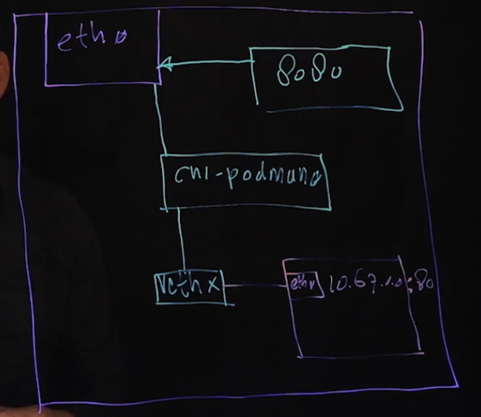

## MODULE 1 CONTAINER FUNDAMENTALS

## 1 INTRODUCTION TO CONTAINERS AND KUBERNETES

### 1.2 Understanding Container Architecture

- The lowest layer is provided by Linux kernel features
  - namespaces: isolation that is implemented for different parts of the kernel
  - cgroups: restrictions to resource usage
  - seccomp: a security profile that defines which system calls can be used by a process
  - selinux: mandatory access control that isolates container processes from the host and other containers
- The container engine (runc) runs the container, which from the Linux kernel perspective is a separate process
- A high level tool is provided to manage the container runtime (crio, containerd)
- The foundation of any running container is the container image
- A high level tool is provided to manage the container image (docker, podman)
- Images are provided by a public or private repository

- Docker has set some standards, that are guaranteed by the Open Container Initiative founded by Docker
- OCI defines a set of standards formats and components

### 1.3 UNDERSTANDING CONTAINER ENGINE

The container engine takes a container image and turns it into a container
It typically consists of a runtime, a CLI tool, and sometimes a daemon
Different container engines are provided
  - Podman
  - Systemd
  - Docker (not supported, breaks above RHEL8)
  - LXC

The container runtime is a specific part of the container engine, and 2 of them are commonly used
  - crio-o
  - containerd

The container runtime takes care of
  - Provide the mount point
  - Communicate with the kernel
  - Set up cgroups

runC is a lightweight universal container runtime
It is the default runtime defined by the OCI
It is the specific part that focuses on creating containers
As such, it's included in cri-o as well as containerd
crio-o and containerd are adding features, like container lifecycle management and container image management

### 1.4 UNDERSTANDING CONTAINER NEEDS IN THE DATACENTER

Stand-alone container limitations

- Storage in containers is ephemeral
- Scaling up containers is not easy
- Providing access to containers is complex
- Providing site-specific information for running a container is complex

Datacenter orchestration features

- Scalability: ability to scale up/down the workloads running in containers
- Availability: ensuring that a sufficient number of containers is always running
- Decoupling: separating site-specific data from static code
- Accessibility: providing a uniform way to access workloads, regardless if they're provided by 1 or multiple containers
- Persistent storage: ensuring that data generated by and from containers outlives the container lifetime

### 1.5 UNDERSTANDING KUBERNETES AND OPENSHIFT

Understanding unique Openshift features

- Source-to-image (S2I): automatically build container images from source code and run these as orchestrated containers in a CI/CD manner (detects changes in source code and redeploy)
- Routes: a feature that easily exposes access to running application workloads
- Operators: provide a wide range of additional features through OperatorHub
  - Storage providers
  - Monitoring and metering software
  - Applications that integrate in the Kubernetes API
- More developed Kubernetes features, like RBAC and other API extensions

## 2 RUNNING CONTAINERS

### 2.1 RUNNING CONTAINERS ON PODMAN/CRI-O

Understanding how to run containers

- Container images are configured with an entrypoint which is the default command to be executed
- If the container starts a service, the entrypoint is executed and the container will continue to run in the foreground
- If the entrypoint is just a command, it is executed, and the container will exit after its execution
- System containers start a service as an entrypoint and after that just quits
- A container can be a fancy way to run a command

Running containers with podman

- Before, decide if you want to run it as a rootless container or with root privileges
- Use `podman search` to find a container image
- To download before using it, use `podman pull`
- Check that images are available using `podman images`
- Use `podman run` to run a container
- Notice that access to Red Hat registry requires credentials
  - Use `podman login` to login
  - Automatic from a root shell

```
sudo yum module install container-tools
sudo podman search ubi
sudo podman pull ubi8/ubi
podman images
podman run ubi8
podman ps
podman ps -a
podman run ubi8/ubi echo hello world
podman run nginx
podman run nginx -d
podman run -it ubi8/ubi /bin/bash
```

### 2.2 UNDERSTANDING ROOTLESS CONTAINERS

- A rootless container runs with limited privileges
- A root container runs with root privileges
- Rootless containers do not get an IP address
- Rootless containers cannot bind to a privileged port
- Rootless containers have limited access to the filesystem
- Rootless containers are the default in Openshift

Using rootless images

- To run rootless containers, rootless images must be provided
- Many images on Docker Hub require being started as root
- On Docker Hub, look for bitnami images which run as rootless containers
- In a Red Hat environment, get images from the Red Hat registries as these are rootless by default

```
podman run -d nginx
podman inspect -l (last) -f (filter) "{{ .NetworkSettings.IPAddress }}"
sudo podman run -d nginx
sudo ip a
  cni-podmanX -> virtualization bridge
  vethX -> virtual ethernet device attached to the container
sudo podman inspect -l (last) -f (filter) "{{ .NetworkSettings.IPAddress }}"
```



### 2.3 UNDERSTANDING CONTAINERS AND THE HOST OS

- From the host OS perspective, a container is just a process
- A well restricted process though, as namespaces, cgroups and SELinux limit what the container can do
- Use  `ps fax | less` and look for processes that are started by `runc` and the arguments passed
- Linux kernel limitations can be applied to restrict processes regarding resource usage as well as access to other resources
- Notice that even specific host OS containers run on the host Linux Kernel

### 2.4 PROVIDING VARIABLES AT CONTAINER START

- `-e key=value`
- Some images refuses to start if the right variables are not provided
- To analyze if a container needs additional values on startup, use `podman logs <container-name>`

```
man podman-run
 search for /examples
```

## 3 MANAGING CONTAINER IMAGES

### 3.1 USING REGISTRIES

- Images are distributed using registries
- An image registry is like a Git repository and provides access to images
- Common public registries
  - quay.io: Red Hat sponsored
  - catalog.redhat.com: Red Hat Container Registry
  - hub.docker.com: Docker Hub
  - cloud.google.com/container-registry: Google Container Registry
- Private registries can be added as well

Configuring registry access

- `/etc/containers/registries.conf`
- `[registries.search]` is the list of default registries to be used
- `[registries.insecure]` are private registries that are not secured with TLS keys can be listed
- `[registries.block]` blocked registries

Registry authentication

- registry.access.redhat.com requires authentication
- `podman login -u <username> -p <password> [registry.access.redhat.com]`
- After authentication, images can be downloaded, and they're stored in the user home directory
- Images downloaded with sudo privileges are stored in `/var/lib/containers/storage/overlay-images`

### 3.2 MANAGING IMAGES

```
podman pull or podman run
podman images
podman image list
podman rmi <image-name>
podman rmi -a
```

Saving/loading images

```
podman save quay.io/bitnami/nginx:latest -o nginx.tar
podman load -i nginx.tar
```

### 3.3 WORKING WITH TAGS

- Used to further identify images
- Used to support multiple releases of the same image
- `latest` is the default tag
- SemVer
- To get information about available versions before pulling use 
  - `podman search mariadb`
  - `skopeo inspect docker://registry.redhat.io/rhosp15-rhel8/openstack-mariadb`
- To apply a tag `podman tag <image-name> <image-name>:<tag>`

### 3.4 SHARING IMAGES

- Standard images are downloaded from registries
- Developers may apply changes to standard images, which later need to be distributed
  - By saving the modified image to a .tar file
  - By pushing the changes to an image registry
- As a more advanced option, images may be built from scratch using `buildah` or `Dockerfile`

Modifying images

- The easiest way to apply modifications to images is using `podman commit`
- Using `Dockerfile` is preferred
  - `commit` keeps logs and more runtime information in the captured images
  - `commit` requires you to work with complete images, whereas `Dockerfile` is just a description of the work to be done to create the images
- While using `podman commit` the image format can be specified as an option
  - `docker`
  - `oci`
- Before using `podman commit`, use `podman diff` to get the diff between the running container and the original image

```
podman run -d --name newnginx nginx
podman ps
podman exec -it newnginx /bin/bash
echo hello > /usr/share/nginx/html/index.html
exit
podman diff newnginx
podman commit newnginx newnginx:latest
```

Pushing images to a registry

- To upload an image to a registry, it must be tagged, and the image name must include the full registry name
- Also, authorization on the registry is required
- Use  `podman push <registry>[:port]/</registry><image-name>:<tag>`

### 4 MANAGING CONTAINERS

#### 4.1 GETTING CONTAINER STATUS INFORMATION

- `podman run myimage` starts a container with its default entrypoint
- `podman run -it myimage sh` runs a non-default entrypoint
- `exit` closes the current application and may shut down the container
- `Control+p, Control+q` detaches from the current application
- `podmain run -d myimage` runs an image in detached mode
- `podman ps` lists all running containers
- `podman ps -a` shows all containers, including stopped ones

Getting more information

- `podmain inspect mycontainer` shows current properties of running containers
- `podman image inspect myimage` shoes properties about images on the local system
- `podman logs` connects to the entrypoint application STDOUT

Common container management tasks

- `podman stop` stops a container gracefully
  - `podman stop -a` to stop all containers
  - `podman stop -t <timeout>` stops a container after <timeout> seconds
- `podman restart` will restart a previously stopped container using container data that is already locally available, or restart the container if it is already running
- `podman start` will start a container that is currently in stopped state
- `podman kill` is used to send UNIX signals to maniputlate the container state
  - By default, SIGKILL
  - `podman kill -s <signal>` to send a signal to the container
- `podman rm` deletes a container, which also deletes its current state from the system

#### 4.2 EXECUTING COMMANDS WITHIN CONTAINERS

- Each container comes with an entrypoint command
  - On application containers, this is a complete application
  - On system containers, this is typically a shell
- After running the entrypoint command, the container is done
- Use `podman exec mycontainer bash` to run any additional command in an already running container
- Use `podman run mycontainer bash` to replace the entrypoint command with the command that is provided
- If this doesn't work, use `podman run mycontainer --entrypoint=bash`

- Once into a container, you can inspect the entrypoint with `cat /proc/1/cmdline`
  - `podman run -it nginx bash` -> bash
  - `podman exec -it nginx bash` -> nginx: master process nginx -g daemon off

#### 4.3 ATTACHING STORAGE TO CONTAINERS